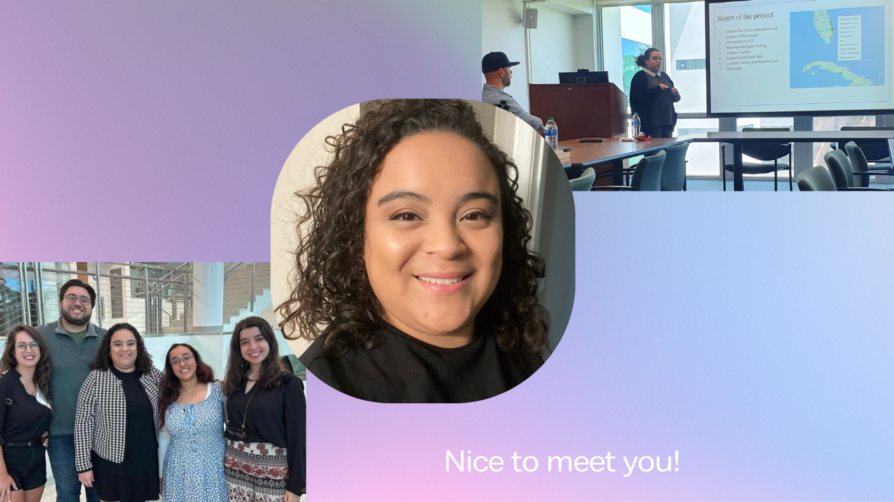

### Education

2021-2026 College of Arts and Sciences English PhD - University of Miami

2021-2023 Applied linguistics Graduate Program (PosLA) MA - State University of Ceará

2020-2021 Englisch Literaturwissenschaft Anglistik MA - Universität Bielefeld

2014-2016 Applied Linguistics Graduate Program (PosLA) MA - State University of Ceará

2009–2013 English Language and Literature BA - State University of Ceará

### Research Experience
2023 – Present – Archival digitization for the UCLA [Comedias Sueltas Database](https://www.comediassueltasusa.org/)
- Digitization of Early Modern Spanish plays at the University of Miami’s Special Collections

2021 – Present – Research Assistant on Latin American Literature for Dr. Yolanda Martinez-San Miguel
- Collect literary and bibliographical resources on Latin American literature; manage course online platforms; translated texts from Portuguese to English; transcribed interviews for oral archives; managed and catalogue university archives.

2014 – 2016: Visual critical literacy in adapted literature books for EFL
- Master’s research project proposing multimodal didactic uses of literature books for English as a Foreign Language.

2011 – 2013: Visual Literacy: Multimodality in educational genres, didactic materials, and contexts.
- Undergraduate research project, analyzing and describing the multimodal approaches in English books for Brazilian highschoolers.

### Digital Projects

2023 - Digital edition of the 1591 Pamphlet _Newes from Scotland_

2022-Present - Volunteer work for the [Survey of Scottish Witches Database](https://witches.shca.ed.ac.uk/index.cfm?fuseaction=home.main)

2022 Summer Fellowship - Mapping Literary Miami Project with ArcGIS - Mapping [_Dreaming in Cuban_](https://storymaps.arcgis.com/stories/f82a7f09276f4dbb96b5784bfd5e479d)

### Work Experience

#### Event Organization
- Organized the University of Miami’s 2023 edition of the DHRI (Digital Humanities Research Institute), an intensive two-day conference with workshops and graduate roundtables.

#### College Teaching
- College Teacher | University of Miami | Aug 2022 – Present
Teach academic writing and research skills for college freshmen from diverse majors, nationalities, and backgrounds.

#### Tutoring, editing, writing and translation
- Writing Tutor at the Athletic Department at the University of Miami, Dec 2022 – Present
- Writing Center Tutor at the University of Miami, Aug 2021 – May 2022
Advised undergraduate and graduate students and alumni from the University of Miami regarding the editing, crafting, and polishing the form and content of their written assignments.
- Private Teacher of English as a Second Language
Ran my own business as an English teacher for specific purposes. Designed preparatory classes for SAT, TOEFL, GRE and academic English, offering exclusive advice and personalized practice to help students improve their English skills and scores, in live and recorded classes.
- English Teacher, Writer and Editor at Desenrolado, Fortaleza, Brazil, Jan 2020 – Aug 2022
Created, edited and reviewed scripts for short, recorded English High School classes.

#### TESOL teaching
- English Teacher (TESOL) at Cultura Inglesa, Fortaleza, Brazil, Feb 2020 – July 2020
- English Teacher (TESOL) at Ceará Foreign Language Center, Fortaleza, Brazil, Feb 2012 – Dec 2015
- English Teacher (TESOL) at Poliglota Institute, Fortaleza, Brazil, Aug 2011 – Dec 2014
- Internship as English Teacher (TESOL) at State University of Ceará, Fortaleza, Brazil, Mar 2010 – Jun 2011
- English Teacher (TESOL) at Wizard School, Fortaleza, Brazil, Aug 2009 – Dec 2009

#### Primary and Secondary School teaching
- English High School Teacher at Antares School, Fortaleza, Brazil, Aug 2014 – Aug 2019
Prepared students for specific English university entrance exams. There was no didactic material for this public, so I developed our own book about the necessary skills, including reading strategies, vocabulary, grammar and writing.
- English High School Teacher at Master School, Fortaleza, Brazil, Jan 2015 – Aug 2019
- English High School Teacher, Lourenço Filho School, Fortaleza, Brazil, Mar 2019 – Aug 2019
- English Teacher at Osmamir Primary School, Fortaleza, Brazil, Feb 2009 – Jul 2009

#### Languages and Skills
- Languages: English – Fluent; Portuguese – Native; Spanish – Conversational; German – Conversational; Latin – Advanced
- Design (Canva, Power point, Adobe Illustrator, video editing);
- Blog and website writing and management (GitHub, Markdown, HTML, CSS, XML);
- Data collection and analysis; mapping and visualization tools such as ArcGIS.